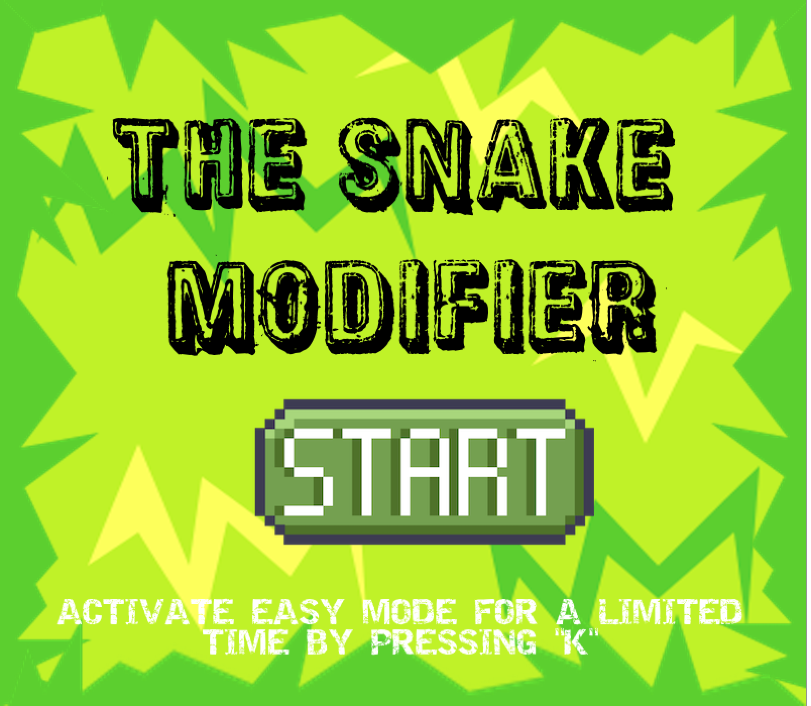
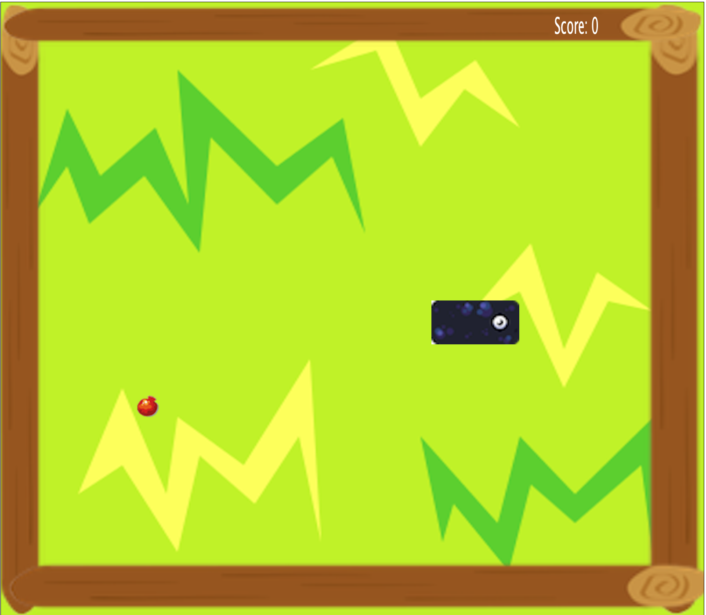
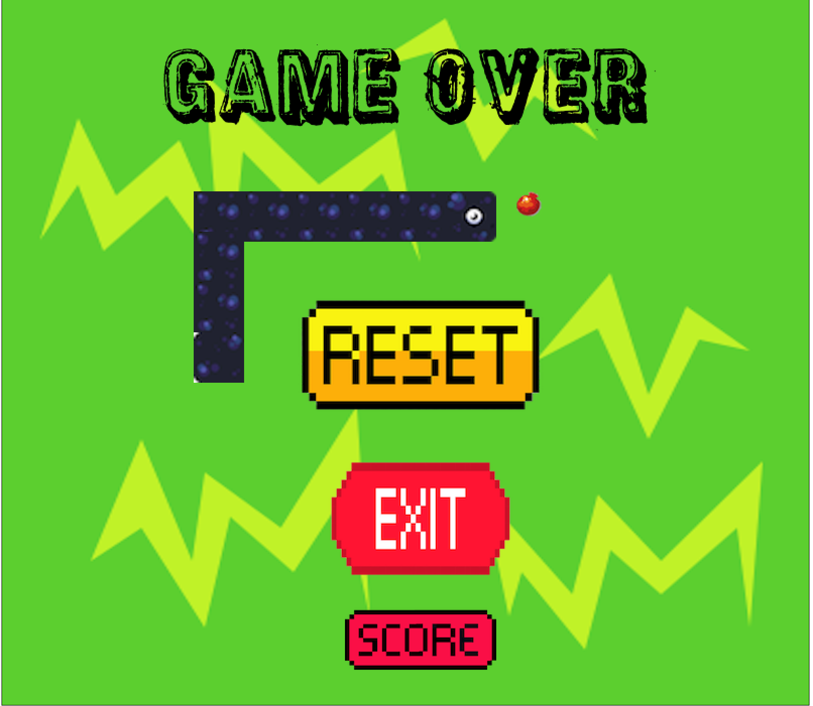

# The Snake Modifier

In this project, our team developed a version of the classic Snake game using Java and the SimpleGraphics library. We focused on enhancing the traditional gameplay by incorporating an easy mode for new players, an Easter egg feature and a cheat code. Additionally, we integrated background music to enrich the user experience, making the game more engaging. The final product was packaged into a JAR file.

---

## Screenshots

| Menu | In Game | Game Over |
|------|---------|-----------|
|  |  |  |

---

## How to Play

### Controls

| Key | Action |
|-----|--------|
| `W` | Move Up |
| `A` | Move Left |
| `S` | Move Down |
| `D` | Move Right |
| `K` | Activate **Double Score** mode (once per game) |
| `Space` | **Cheat code** — adds 300 points (once per game) |

### Objective

Guide the snake to eat food without hitting the walls or its own body.  
Each piece of food makes the snake grow longer and awards points.  
The game ends the moment the snake collides with a wall or itself.

---

## Food

| Food | Points | Growth | Spawn Chance |
|------|--------|--------|--------------|
| 🍎 Fruit | 50 pts | +1 segment | 90% |
| 🌶️ Chili | 100 pts | +2 segments | 10% |

> Activate **Double Score** mode with `K` to double all food points for 10 seconds.

---

## Scoring

- Eating a **Fruit** gives **50 points** (100 with double score active)
- Eating a **Chili** gives **100 points** (200 with double score active)
- The **high score** is saved to `HighScore.txt` and persists between sessions
- Press `Space` once per game for a secret **+300 points**

---

## How to Run

### Requirements

- Java 17+
- Apache Ant

### Build and run

```bash
# Build the JAR
ant

# Run the game
java -jar build/the-snake-modifier.jar
```

---

## Project Structure

```
src/
└── com/codeforall/online/thesnakemodifier/
    ├── Main.java               Entry point
    ├── audio/
    │   └── AudioPlayer.java    Background music and sound effects
    ├── food/
    │   ├── Food.java           Food interface
    │   ├── AbstractFood.java   Shared spawn/hide logic
    │   ├── Fruit.java          Regular food item
    │   ├── Chili.java          Special food item
    │   ├── FoodFactory.java    Creates food at random
    │   └── FoodType.java       Enum (FRUIT, CHILI)
    ├── game/
    │   ├── Game.java           Game loop and state management
    │   ├── Grid.java           Boundary management
    │   └── CollisionHandler.java  Collision detection
    ├── input/
    │   ├── MyKeyboard.java     WASD + special key handling
    │   ├── MyMouse.java        Menu click handling
    │   └── GameOverMouse.java  Game over screen click handling
    ├── movement/
    │   ├── Direction.java      Enum (UP, DOWN, LEFT, RIGHT)
    │   └── SnakeMovement.java  Direction control and step logic
    ├── score/
    │   ├── Score.java          Singleton score tracker + high score
    │   └── ScoreDisplay.java   On-screen score text
    ├── snake/
    │   └── Snake.java          Snake body and growth state
    └── ui/
        ├── Menu.java           Start screen
        └── GameOverScreen.java Game over screen with restart/quit/score
```

---

## Built With

- **Java 17**
- **Apache Ant** — build system
- **SimpleGraphics Library** — graphics and input library

---

## Contributors

- **Carina Leite** — [GitHub](https://github.com/carinaleite)
- **Francisco Simões** — [GitHub](https://github.com/franciscosimoes)
- **Patrícia Soares** — [GitHub](https://github.com/PatriciaS16)

---

## Collaboration Tools

- **Discord** — team communication and meetings
